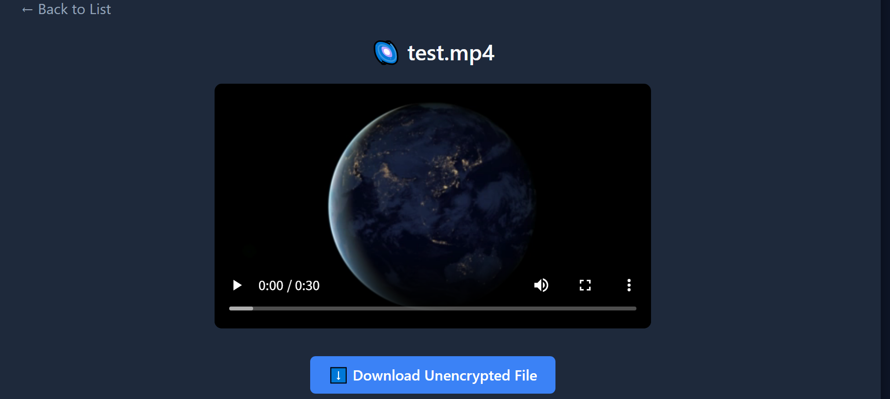
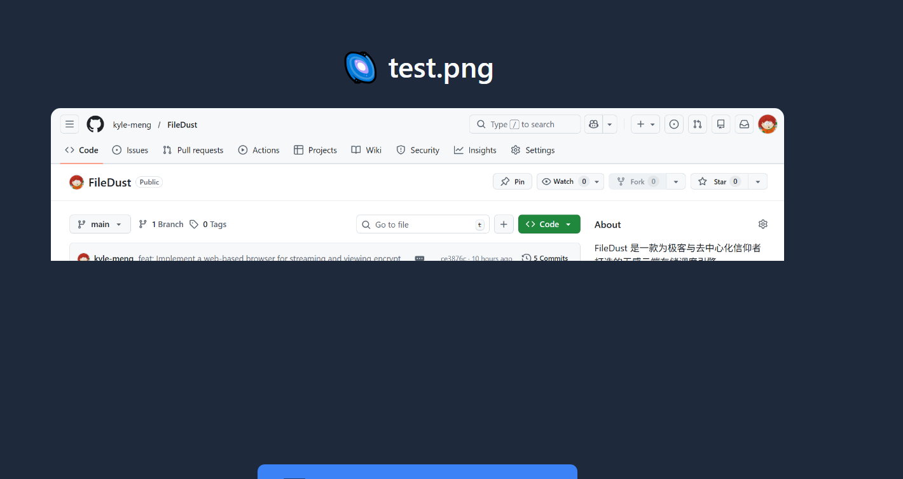
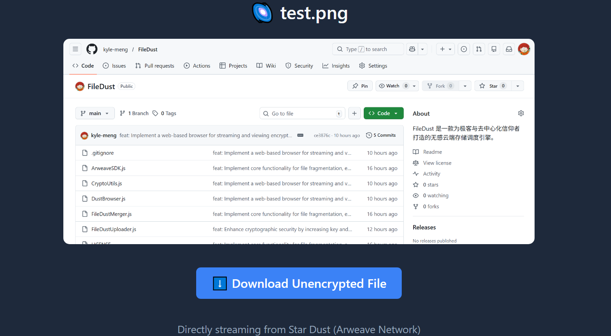
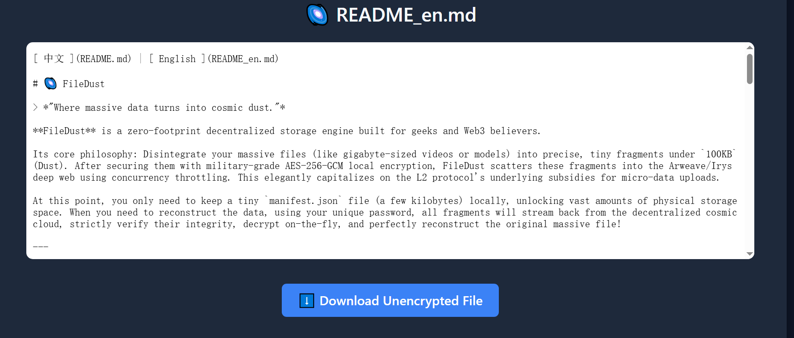

[ 中文 ](README.md) | [ English ](README_en.md)

# 🌌 FileDust (星尘)

> *"Where massive data turns into cosmic dust." - 当庞然巨物化作漫天星辰。*

**FileDust** 是一款为极客与去中心化信仰者打造的**无感云端存储调度引擎**。

它的核心哲学是：将你的巨型文件（如视频、模型集）化整为零，精准切割为不超过 `100KB` 的微小碎片（Dust），经过军工级本地 AES-256GCM 加密颠覆后，利用并发限流技术抛洒入 Arweave/Irys 去中心化深网（从而极其优雅地利用 L2 免费微型数据阈值的底层红利）。

此时，你在本地只需以极低容量保留一张几千字节的「星图文件」（`.dust`），便完成了一场华丽的本地物理空间释放。当需要重构数据时，凭你的唯一密码指令，所有碎片便会从漫天星云中流式汇聚、严格校验、瞬时解密，最终复刻重装出原本的庞然大物！

---

## 🌟 核心特性 (Core Features)

- ✂️ **纳米级精密切割 (Nano-Chunking)**
  默认应用 `90KB` 的深思熟虑防超发安全阀限，不浪费一丝冗余，将任何大文件轻柔切分降维。
- 🛡️ **军工级端到端隐身 (E2E AES-256-GCM)**
  上传入链的，皆是毫无规律的数据噪波，连上帝也无法在公有链上拼凑或猜透半分。由本地生成高强度的密码 (Password) 与长达 32 bytes 的随机盐 (Salt) 结合衍生出 128 bytes 密钥，让你能够重组宇宙。
- 🌊 **黑洞级内存防波堤 (Streaming Reconstruct)**
  独有的极简「下载一个块 -> 瞬时解密 -> 原子追加 -> 释放」的流式管道设计。哪怕重组 10GB 史诗视频，Node.js 依然安诺如山，内存增压不超过区区 `2MB`。
- 🚦 **反封锁防伪装引擎 (Ratelimit & Jittering)**
  内建 `p-limit` 并发软锁芯，自带底层重试异常背压与随机休眠抖动（Jitter），温柔而克制地与底层免费节点（如 Irys/Bundlr）交互，避免触发防 DDoS 洗礼墙导致 IP 禁杀。
- 📺 **星际流媒体播放 (Dust Browser)**
  内置 Express 本地服务器代理前端渲染，真正实现从去中心化链上「边下边看」的流媒体多开和拖拽缓存体验。图片秒看，视频畅连，重构无感体验提升至云盘级水准！

---

## 🛠️ 安装指引 (Installation)

准备进入零维空间，请确保你拥有 [Node.js](https://nodejs.org/) >= 18 运行时：

```bash
git clone https://github.com/YourUsername/FileDust.git
cd FileDust
npm install
```

*(💡 引擎初次觉醒时，会贴心在同级目录下生成 `wallet.json`，供零感挂载去中心化协议使用，无繁琐跨界配置)*

---

## 🚀 极速起飞 (Quick Start)

在你的代码中只需两段咒文，便能驱使星海。

### 1. 将文件放逐星海领域 (Disintegrate to Dust)

```javascript
import { uploadToDust } from "./FileDustUploader.js";

async function makeItDust() {
    // 祭出法器: 本地文件路径、你的专属密码字典、期望切割尺寸阀门(默认安全值为90KB)
    const manifestPath = await uploadToDust("./videos/secret_movie.mp4", "SuperStrongPassword123!");
    
    console.log(`生成星图索引卡: ${manifestPath}`);
    // 👋 此时，你可以放心把体积惊人的 secret_movie.mp4 从地球硬盘上永远抹除了
}
makeItDust();
```

> 🚨 **【极其关键的生死存亡提示】** 🚨
> 仔细看你的当前目录，是不是刚生成了一个叫 **`salt.json`** 的文件？
> 没错，由于极度严苛的加密标准，你的最终加密密钥是由**你输入的密码 (Password) + 这份 32 字节的随机盐 (Salt)** 混合衍生而成的。
> 这意味着随机盐 (Salt) **并没有**暴露在公有链的加密文件头部！
> **请你务必将「你的密码」、「`.dust` 星图文件」以及「`salt.json`」这三件绝世法宝妥善保管！** 丢了 `salt.json`，即便上帝拿着你的原密码，也永远无法在宇宙中拼凑出你的数据了。

### 2. 将星尘重铸为原石 (Reconstruct from Dust)

```javascript
import { downloadFromDust } from "./FileDustMerger.js";

async function reconstruct() {
    // 喂给它那轻如鸿毛的 .dust 坐标，星河自会倒流重组
    await downloadFromDust("./videos/secret_movie.mp4.dust", "SuperStrongPassword123!");
    
    // 🎉 你的 secret_movie.mp4 毫发无伤地降临在当前目录
}
reconstruct();
```

### 3. 星际流媒体浏览器 (Dust Browser)

如果你的星尘是**图片**、**视频**、**音频**甚至是**文本/Markdown**文件，你可以免去完整下载，直接启动本地去中心化浏览器网关：

```bash
# 启动本地代理
node DustBrowser.js <你的重组密码>
```

👉 **运行后访问:** `http://localhost:3000`
页面将挂载并渲染当前目录下所有的 `*.dust` 星图，点击即可实现多路并行的「边下、边解密、边预览」效果！且内置了便捷的一键上传与自动切片工具。

**🌟 效果预览：**

* **🌌 星图索引列表页：**
  <br>

* **🎬 视频流星尘边下边播 (原生内存池调度缓冲)：**
  <br>

* **🖼️ 图像星尘瞬时渲染：**
  <br>
  <br>


* **📝 文本与 Markdown 星尘穿层阅读：**
  <br>

---

## 📜 极客誓言与版权通告 (License & Legal)

本项目采用特殊的 **PolyForm Noncommercial License 1.0.0** 许可证严苛护航。

- ✅ **无条件允许**：任何个人极客使用、代码拆解学习、技术修仙、基于非商业利益目的的自我服务构建。
- ❌ **绝对的禁止**：任何公司主体、初创团队或个人，**将此引擎的整体机制或核心切割逻辑嵌入、伪装为 SaaS 网盘服务、增值模块来间接/直接套版牟取任何形式的商业对价**。

### ⚠️ 永久存储声明与免责警告 (Disclaimer & Warning)

1. **链上不可篡改性**：基于 Arweave 协议，**所有经过碎片抛洒入链的数据都是永久的、不可撤销的、不可删除的**。请深思熟虑你要上传的任何内容，因为一旦上传，即便是神也无法从网络中将其抹去。
2. **严禁滥用与非法用途**：尽管 FileDust 最大化利用了 L2 网络（如 Turbo/Irys）的微型数据免费红利，从而让你拥有了近乎“无限空间”的安全存储。但是，本工具**仅为极客实验、数据主权理念学习与个人非侵权/合法资产备份而开发**。
3. **法律责任**：**严禁使用 FileDust 处理、传播任何违反您所在国家/地区法律的数据（包括但不限于骇客材料、非法交易资料、侵权盗版等）。作者与贡献者对使用本工具所产生的任何数据及法律后果概不负责，且不提供任何形式的商业保障或客服义务。**

保持纯粹，只为热爱极客文化的开拓者而留存。